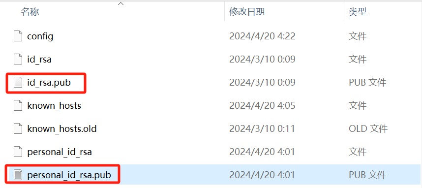
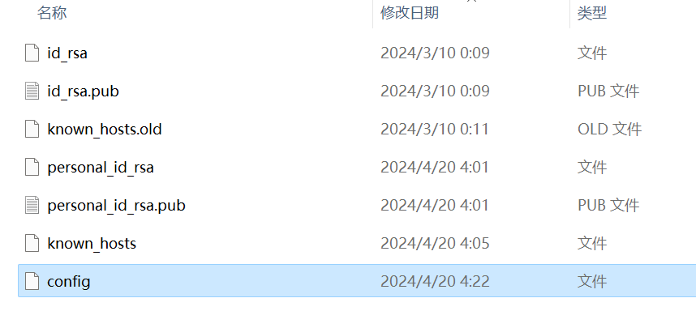

每个程序员都可能有多个 GitHub 账号，一般来说公司会有一个专有的，同时我们个人也会写一些代码上传到自己私人的 github 仓库，下面就和大家聊一下如何在一台电脑上同时使用多个 GitHub 账号，通过以下四个步骤就可以实现。

## 1. 生成密钥

首先是使用两个账号成两个 SSH 密钥。

假设为 `my_company@email.com` 是公司的 github 账号，而 `my_personal@email.com` 是你的个人 github 账号。

首先使用一下命令生成了一对公司账号的秘钥，默认生成的文件名是 `id_rsa` 和 `id_rsa.pub`。

```shell
ssh-keygen -t rsa -C "my_company@email.com"
```

windows 下保存在了`C:\Users\your account\.ssh`文件夹内。


:::tip
一般来说，大部分程序员都可能配置过一个 github 账户，所以如果已经用公司或者个人账号生成过了密钥，这一步就可以略过了，可以直接开始生成另外一个邮箱的密钥。
:::

然后用个人邮箱 `my_personal@email.com` 使用此命令再生成一对密钥，这时候要注意重命名，否则会覆盖上面的密钥文件。

```shell
ssh-keygen -t rsa -C "my_personal@email.com"
```

这里我使用的是`personal`命名，生成了一对新的秘钥`personal_id_rsa` 和 `personal_id_rsa.pub`，可以根据自己喜好来命名。


然后分别将这两对公钥配置到对应的 GitHub 账户中，这个步骤就略过了。


## 2. 编辑 config 配置文件

编辑`.ssh`目录下的 config 文件。如果该文件不存在的话，直接创建一个就好。


添加如下内容：

```sh
# 公司
Host github_company # 公司账户的github host
Hostname ssh.github.com
IdentityFile ~/.ssh/id_rsa # 对应公司账户的私钥
port 22
```

```sh
# 个人
Host github_personal # 个人账户的github host
Hostname ssh.github.com
IdentityFile ~/.ssh/personal_id_rsa # 对应个人账户的私钥
port 22
```

## 3. 测试 ssh 连接

:::tip
这里一定是要先把两个公钥添加到对应的 GitHub 账户后，再进行下面的 ssh 连接测试，否则肯定是连接不上，会显示 permission denied。
:::

```shell
ssh -T git@github_company
ssh -T git@github_personal
```

如果都能正常返回如下信息，就说明配置正常，第一次可能会有一个提示，点击回车即可。

`Hi xxx! You've successfully authenticated, but GitHub does not provide shell access.`


同样的方式你就可以配置更多的以 SSH 登录的不同 git 用户。

## 4. git 仓库配置设置

### clone 新的项目

首先要删除 git 配置的全局用户名和邮件地址。

```sh
# 删除全局设置
git config --global --unset user.name
git config --global --unset user.email
```

clone 项目到本地，注意这里 git@后面就是我们在 config 文件里配置 Host，这里如果我们需要 clone 的项目是公司项目，Host 就是 github_company，其他的依次类推。

```sh
git clone git@github_company:xxx/example.git
```

进入 clone 项目目录下，为每个项目单独配置特定的 name 和 email，后面所有 commit 的信息中，都会以这个设置的 name 和 email。

```sh
git config --local user.name xxxx
git config --local user.email xxx
```

### 已有项目

如果是之前已经下载下来的项目，需要修改远程仓库 remote url，然后再单独配置 name 和 email。

```sh
git remote set origin git@github_company:xxx/example.git # 公司项目仓库
git remote set origin git@github_personal:xxx/example.git # 个人项目仓库
```

## 总结

其实，上面的.ssh/config 配置文件的意思就是，按照你设置远程仓库时使用不同的 Host 名称，查找 ssh/config 文件，使用不同的 SSH 密钥连接到 GitHub。这样你就将是以不同的身份访问 GitHub 仓库。
